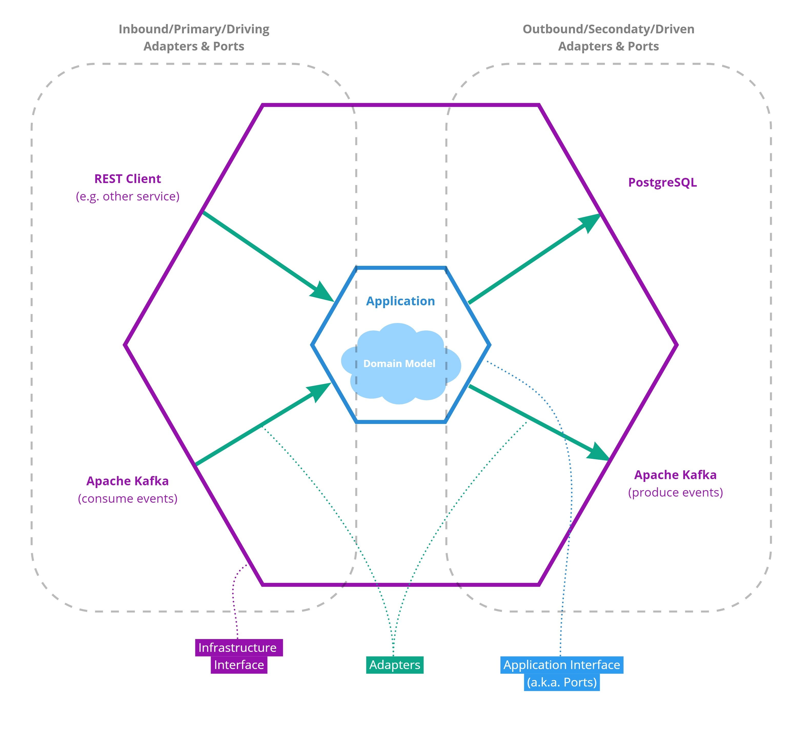

# Hexagonal Architecture

*by {{ git_page_authors }}*  

The "Hexagonal Architecture" design pattern (also known as the "Ports and Adapters" pattern) was originally described by Alistair Cockburn in 2005 (https://alistair.cockburn.us/hexagonal-architecture/). It aims at a clean separation between purely technical concerns such as user interaction, data access, message delivery, and related infrastructure from the core of the application that implements the logic for solving a specific domain/business problem. To circumvent that the technical concerns bleed into our domain logic, an adapter code layer is introduced (**Figure 1**).

**Figure 1| Separation of the application "inside" from the periphery.**

The interaction between the outside infrastructure and the inside application is outlined in more detail in **Figure 2**. The codebase of the core application is using the vocabulary of a domain-specific model. It only has a very abstract understanding of the outside world which manifests itself in the exposed application interface. This interface consists of so-called "ports" that define the interaction point with the outside world using domain-specific language. For each port, adapters are defined (outside of the code base of the core application) that connect the application ports with outside infrastructure and translate between the two sides. Thereby, two different types of ports and adapters can be distinguished:

1. **Inbound (also referred to as primary or driving) adapters:**
 These adapters (and corresponding ports) are calling from the outside into the application. They are putting the application out of an idle state and giving it some task to work on. To this end, this kind of adapters is said to "drive" the application. For example, inbound adapters could provide a RESTful HTTP API that responds to requests coming from an outside client. Another example would be an adapter that subscribes to a specific topic of an Apache Kafka broker and propagates relevant events to the application.

2. **Outbound (also referred to as secondary or driven) adapter:**
These adapters (and corresponding ports) are called directly from within the application. They are thus said to be "driven" by the application. A common example for an outbound adapter would be a data access object (DAO) that interacts with a specific database (e.g. based on PostgreSQL). Another example would be an adapter that publishes events happening in the application to an external Apache Kafka broker.

**Figure 2| Schematic representation of the Hexagonal Architecture design pattern.**

This architectural pattern comes with many benefits. First of all, the application development can primarily focus on the logic needed to solve the domain problem which is the actual motivation for the software project. This logic can be worked on in isolation from the infrastructural details. So development can even progress if not all technical concerns are addressed, yet. Moreover, the application core becomes easier to understand which simplifies maintenance and helps onboarding new developers to the codebase. The domain logic is often already complex enough, hexagonal architecture helps that this complexity is not further inflated by adding technological complexity.

Furthermore, the application becomes less coupled to a specific environment or infrastructural setup. If infrastructural requirements change, chances are high that these changes only affect the thin adapter layer but not the more complex domain logic. For instance, a decision is made to switch from a MongoDB database to a PostgreSQL-based database, this change can be realized by simply providing a new PostgreSQL-specific adapter implementation for the corresponding application port. No changes to the application core itself or the domain logic are needed. On top of that, for open source and open community projects like GHGA, the described infrastructural agnosticism has the additional advantage that it can increase the reach of the developed software. Other projects can easily integrate our applications into their system even if they are relying on an entirely different infrastructure stack. Again, all changes are restricted to the adapter layer.

Another advantage is that the isolation from infrastructure allows performing true unit tests on the domain logic. For this purpose, "mock" adapter can be provided for outbound ports (inbound adapters are not relevant for unit testing. This does not only improves the quality of testing by cleanly separating unit from integration tests but also it can also significantly increase the speed of running the test set. This is important to effectively integrate testing into software development without slowing it down.

## Additional Material

The above document is only intended to provide a high-level overview of the hexagonal architecture design pattern. The following material can help to further understand the use cases and implementation options for this design pattern (most important listed first):

- A conference talk that provides a pragmatic introduction to the hexagonal architecture based on code examples): https://www.youtube.com/watch?v=22WUhddwkS8
- The original proposal of the hexagonal architecture can be found here: https://alistair.cockburn.us/hexagonal-architecture/
- This presentation by Robert C. Martin (better known as "Uncle Bob") helps to better understand the motivation for hexagonal design. However, it's not exactly about hexagonal design but about a similar concept he calls "Clean Architecture": https://www.youtube.com/watch?v=Nsjsiz2A9mg
